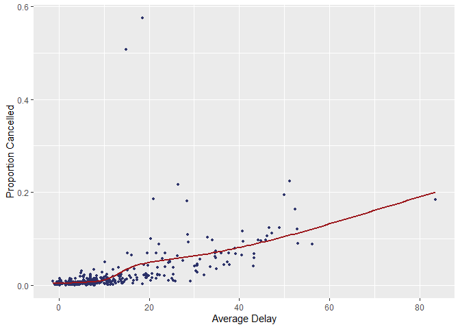

433HW2
================
Yifan Zhang

## Load necessary libraries and look at the data

``` r
library(dplyr)
```

    ## 
    ## Attaching package: 'dplyr'

    ## The following objects are masked from 'package:stats':
    ## 
    ##     filter, lag

    ## The following objects are masked from 'package:base':
    ## 
    ##     intersect, setdiff, setequal, union

``` r
library(nycflights13)
library(ggplot2)

flights
```

    ## # A tibble: 336,776 x 19
    ##     year month   day dep_time sched_dep_time dep_delay arr_time sched_arr_time
    ##    <int> <int> <int>    <int>          <int>     <dbl>    <int>          <int>
    ##  1  2013     1     1      517            515         2      830            819
    ##  2  2013     1     1      533            529         4      850            830
    ##  3  2013     1     1      542            540         2      923            850
    ##  4  2013     1     1      544            545        -1     1004           1022
    ##  5  2013     1     1      554            600        -6      812            837
    ##  6  2013     1     1      554            558        -4      740            728
    ##  7  2013     1     1      555            600        -5      913            854
    ##  8  2013     1     1      557            600        -3      709            723
    ##  9  2013     1     1      557            600        -3      838            846
    ## 10  2013     1     1      558            600        -2      753            745
    ## # ... with 336,766 more rows, and 11 more variables: arr_delay <dbl>,
    ## #   carrier <chr>, flight <int>, tailnum <chr>, origin <chr>, dest <chr>,
    ## #   air_time <dbl>, distance <dbl>, hour <dbl>, minute <dbl>, time_hour <dttm>

``` r
?flights
```

    ## starting httpd help server ...

    ##  done

``` r
flights[,5:10]
```

    ## # A tibble: 336,776 x 6
    ##    sched_dep_time dep_delay arr_time sched_arr_time arr_delay carrier
    ##             <int>     <dbl>    <int>          <int>     <dbl> <chr>  
    ##  1            515         2      830            819        11 UA     
    ##  2            529         4      850            830        20 UA     
    ##  3            540         2      923            850        33 AA     
    ##  4            545        -1     1004           1022       -18 B6     
    ##  5            600        -6      812            837       -25 DL     
    ##  6            558        -4      740            728        12 UA     
    ##  7            600        -5      913            854        19 B6     
    ##  8            600        -3      709            723       -14 EV     
    ##  9            600        -3      838            846        -8 B6     
    ## 10            600        -2      753            745         8 AA     
    ## # ... with 336,766 more rows

``` r
colnames(flights)
```

    ##  [1] "year"           "month"          "day"            "dep_time"      
    ##  [5] "sched_dep_time" "dep_delay"      "arr_time"       "sched_arr_time"
    ##  [9] "arr_delay"      "carrier"        "flight"         "tailnum"       
    ## [13] "origin"         "dest"           "air_time"       "distance"      
    ## [17] "hour"           "minute"         "time_hour"

``` r
str(flights)
```

    ## tibble [336,776 x 19] (S3: tbl_df/tbl/data.frame)
    ##  $ year          : int [1:336776] 2013 2013 2013 2013 2013 2013 2013 2013 2013 2013 ...
    ##  $ month         : int [1:336776] 1 1 1 1 1 1 1 1 1 1 ...
    ##  $ day           : int [1:336776] 1 1 1 1 1 1 1 1 1 1 ...
    ##  $ dep_time      : int [1:336776] 517 533 542 544 554 554 555 557 557 558 ...
    ##  $ sched_dep_time: int [1:336776] 515 529 540 545 600 558 600 600 600 600 ...
    ##  $ dep_delay     : num [1:336776] 2 4 2 -1 -6 -4 -5 -3 -3 -2 ...
    ##  $ arr_time      : int [1:336776] 830 850 923 1004 812 740 913 709 838 753 ...
    ##  $ sched_arr_time: int [1:336776] 819 830 850 1022 837 728 854 723 846 745 ...
    ##  $ arr_delay     : num [1:336776] 11 20 33 -18 -25 12 19 -14 -8 8 ...
    ##  $ carrier       : chr [1:336776] "UA" "UA" "AA" "B6" ...
    ##  $ flight        : int [1:336776] 1545 1714 1141 725 461 1696 507 5708 79 301 ...
    ##  $ tailnum       : chr [1:336776] "N14228" "N24211" "N619AA" "N804JB" ...
    ##  $ origin        : chr [1:336776] "EWR" "LGA" "JFK" "JFK" ...
    ##  $ dest          : chr [1:336776] "IAH" "IAH" "MIA" "BQN" ...
    ##  $ air_time      : num [1:336776] 227 227 160 183 116 150 158 53 140 138 ...
    ##  $ distance      : num [1:336776] 1400 1416 1089 1576 762 ...
    ##  $ hour          : num [1:336776] 5 5 5 5 6 5 6 6 6 6 ...
    ##  $ minute        : num [1:336776] 15 29 40 45 0 58 0 0 0 0 ...
    ##  $ time_hour     : POSIXct[1:336776], format: "2013-01-01 05:00:00" "2013-01-01 05:00:00" ...

## Problem 1

How many flights have a missing dep\_time? What other variables are
missing? What might these rows represent?

``` r
f <- flights

#flights missing a dep_time
m <- f[is.na(f$dep_time), ]
nrow(m)
```

    ## [1] 8255

``` r
#other missing variables
head(m)
```

    ## # A tibble: 6 x 19
    ##    year month   day dep_time sched_dep_time dep_delay arr_time sched_arr_time
    ##   <int> <int> <int>    <int>          <int>     <dbl>    <int>          <int>
    ## 1  2013     1     1       NA           1630        NA       NA           1815
    ## 2  2013     1     1       NA           1935        NA       NA           2240
    ## 3  2013     1     1       NA           1500        NA       NA           1825
    ## 4  2013     1     1       NA            600        NA       NA            901
    ## 5  2013     1     2       NA           1540        NA       NA           1747
    ## 6  2013     1     2       NA           1620        NA       NA           1746
    ## # ... with 11 more variables: arr_delay <dbl>, carrier <chr>, flight <int>,
    ## #   tailnum <chr>, origin <chr>, dest <chr>, air_time <dbl>, distance <dbl>,
    ## #   hour <dbl>, minute <dbl>, time_hour <dttm>

``` r
summary(m)
```

    ##       year          month             day          dep_time    sched_dep_time
    ##  Min.   :2013   Min.   : 1.000   Min.   : 1.0   Min.   : NA    Min.   : 106  
    ##  1st Qu.:2013   1st Qu.: 3.000   1st Qu.: 8.0   1st Qu.: NA    1st Qu.:1159  
    ##  Median :2013   Median : 6.000   Median :12.0   Median : NA    Median :1559  
    ##  Mean   :2013   Mean   : 5.927   Mean   :14.6   Mean   :NaN    Mean   :1492  
    ##  3rd Qu.:2013   3rd Qu.: 8.000   3rd Qu.:23.0   3rd Qu.: NA    3rd Qu.:1855  
    ##  Max.   :2013   Max.   :12.000   Max.   :31.0   Max.   : NA    Max.   :2359  
    ##                                                 NA's   :8255                 
    ##    dep_delay       arr_time    sched_arr_time   arr_delay      carrier         
    ##  Min.   : NA    Min.   : NA    Min.   :   1   Min.   : NA    Length:8255       
    ##  1st Qu.: NA    1st Qu.: NA    1st Qu.:1330   1st Qu.: NA    Class :character  
    ##  Median : NA    Median : NA    Median :1749   Median : NA    Mode  :character  
    ##  Mean   :NaN    Mean   :NaN    Mean   :1669   Mean   :NaN                      
    ##  3rd Qu.: NA    3rd Qu.: NA    3rd Qu.:2049   3rd Qu.: NA                      
    ##  Max.   : NA    Max.   : NA    Max.   :2359   Max.   : NA                      
    ##  NA's   :8255   NA's   :8255                  NA's   :8255                     
    ##      flight       tailnum             origin              dest          
    ##  Min.   :   1   Length:8255        Length:8255        Length:8255       
    ##  1st Qu.:1577   Class :character   Class :character   Class :character  
    ##  Median :3535   Mode  :character   Mode  :character   Mode  :character  
    ##  Mean   :3063                                                           
    ##  3rd Qu.:4373                                                           
    ##  Max.   :6177                                                           
    ##                                                                         
    ##     air_time       distance           hour           minute     
    ##  Min.   : NA    Min.   :  17.0   Min.   : 1.00   Min.   : 0.00  
    ##  1st Qu.: NA    1st Qu.: 292.0   1st Qu.:11.00   1st Qu.: 5.00  
    ##  Median : NA    Median : 583.0   Median :15.00   Median :27.00  
    ##  Mean   :NaN    Mean   : 695.4   Mean   :14.67   Mean   :25.61  
    ##  3rd Qu.: NA    3rd Qu.: 872.0   3rd Qu.:18.00   3rd Qu.:42.00  
    ##  Max.   : NA    Max.   :4963.0   Max.   :23.00   Max.   :59.00  
    ##  NA's   :8255                                                   
    ##    time_hour                  
    ##  Min.   :2013-01-01 06:00:00  
    ##  1st Qu.:2013-03-07 07:00:00  
    ##  Median :2013-06-12 18:00:00  
    ##  Mean   :2013-06-13 07:07:54  
    ##  3rd Qu.:2013-08-22 15:30:00  
    ##  Max.   :2013-12-31 20:00:00  
    ## 

``` r
# From the summary, we can see in these rows variables dep_delay, arr_time, arr_delay and air_time also miss.

#Representation
#I think these rows represent those cancelled flights. Because they are cancelled, they don't have scheduled and actual departure and arrival times as well as amount of time spent in air.
```

## Problem 2

Currently dep\_time and sched\_dep\_time are convenient to look at, but
hard to compute with because they’re not really continuous numbers.
Convert them to a more convenient representation of number of minutes
since midnight.

``` r
minutes <- function(x){
  for (i in 1: length(x)) {
    if(!is.na(x[i])){
      if(nchar(x[i]) == 1){
        x[i] <- x[i]
      }else if(nchar(x[i]) == 2){
        x[i] <- x[i]
      }else if(nchar(x[i]) == 3){
        x[i] <- as.numeric(substr(x[i], 1, 1)) * 60 + as.numeric(substr(x[i], 2, 3))
      }else{
        x[i] <- as.numeric(substr(x[i], 1, 2)) * 60 + as.numeric(substr(x[i], 3, 4))
      }
    }
  }
  return(x)
}

f$dep_time <- minutes(f$dep_time)
f$sched_dep_time <- minutes(f$sched_dep_time)
head(f)
```

    ## # A tibble: 6 x 19
    ##    year month   day dep_time sched_dep_time dep_delay arr_time sched_arr_time
    ##   <int> <int> <int>    <dbl>          <dbl>     <dbl>    <int>          <int>
    ## 1  2013     1     1      317            315         2      830            819
    ## 2  2013     1     1      333            329         4      850            830
    ## 3  2013     1     1      342            340         2      923            850
    ## 4  2013     1     1      344            345        -1     1004           1022
    ## 5  2013     1     1      354            360        -6      812            837
    ## 6  2013     1     1      354            358        -4      740            728
    ## # ... with 11 more variables: arr_delay <dbl>, carrier <chr>, flight <int>,
    ## #   tailnum <chr>, origin <chr>, dest <chr>, air_time <dbl>, distance <dbl>,
    ## #   hour <dbl>, minute <dbl>, time_hour <dttm>

## Problem 3

Look at the number of cancelled flights per day. Is there a pattern? Is
the proportion of cancelled flights related to the average delay? Use
multiple dyplr operations, all on one line, concluding with
ggplot(aes(x= ,y=)) + geom\_point()

``` r
f %>% 
  group_by(month, day) %>%
  summarize(averageDelay = mean(dep_delay, na.rm = TRUE),
            proportionCancelled = sum(is.na(dep_time) / n())) %>%
  ggplot(aes(x = averageDelay, y = proportionCancelled)) +
  geom_point(size = 1, col = "#2c3269") +
  geom_smooth(se = FALSE, col = "#9b161b") +
  labs(x = "Average Delay", 
       y = "Proportion Cancelled")
```

    ## `summarise()` has grouped output by 'month'. You can override using the `.groups` argument.

    ## `geom_smooth()` using method = 'loess' and formula 'y ~ x'

<!-- -->

``` r
#From the graph, we see that the proportion of cancelled flights is positively related to the average delay.
```
